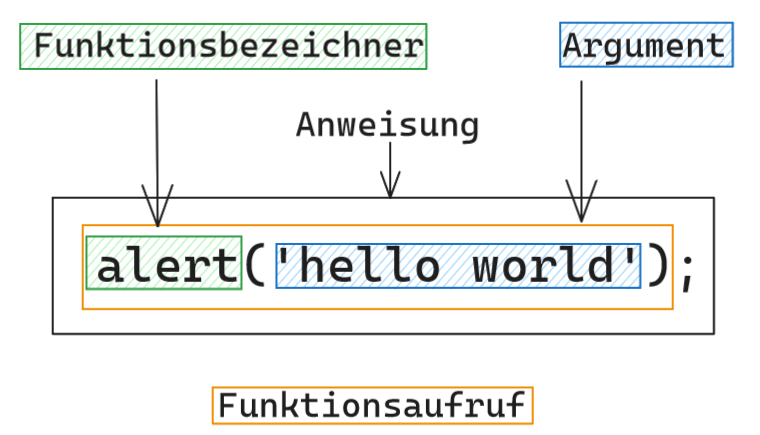

# Markdown zu JavaScript -> JS

## Allgemeines

- JS führt Browserseitig aus
- für Server braucht man node.js
- um zusätzliche Packages zu installieren auf node.js Server: npm (node package manager)
- React Famework für js mit größter Industrierelevanz
- Programmierrichtlinien: spezifische Regeln zur Schreibweise

- Skripte, die mit den Elementem der Website interagieren

## sinnvolle Links

- [nodejs.org](www.nodejs.org) Die offizielle Site zur Serverplattform Node.js. Ausführliche Dokumentation zum JS-Sprachkern und allen Node.js-spezifischen Erweiterungen.

- [caniuse.com](caniuse.com) Kann ich ein bestimmtes Feature benutzen? Diese Site kennt die Antwort. Ausführliche Übersichten zu neuen Features in HTML, CSS und JS mit Angaben zu den Browserversionen und Hinweisen zu Polyfills.

## Hilfreiche Shortcuts

- Konsole öffnen: cmd-alt-j (macOS); strl-shift-j (Windows/Linux)
- Run - den Code in der Konsole ausführen: Enter

## Semikolon!?

:exclamation: es gibt den semikolonlosen Stil und den Semikolon-Stil - mir wurde der Semikolon-Stil empfohlen (und die VSCode Erweiterung Prettier macht dies automatisch -> ASI Automatic Semicolon Inseration)

## Ausgabe in Konsole

`console.log('Hello World');`

`log` ist eine sogenannte Funktion. Ihre aufgabe ist es, in die Konsole (console) zu loggen, d.h. eine Ausgabe von Log-Meldungen einzutragen - wie in einem Logbuch.

- Im Log lässt sich die Ausgabe des Programmes Schritt für Schritt nachvollziehen. 
- Log nicht für Anwender bestimmt, sondern für Programmierer, um den Ablauf eines Programmes nachzuvollziehen

## alert

Die Funktion `alert` öffnet eine sogenannte Alert-Box im Browserfenster. Sie ist dafür gedacht, Anwendern wichtige Warnmeldungen anzuzeigen. Die Alert-Box ist ein modales Pop-up-Fenster, d. h. der Anwender muss sie wegklicken, um die Website weiter benutzen zu können. Aus Usability-Gründen ist von solchen modalen Pop-up-Fenstern abzuraten.  
Außerdem handelt es sich dabei um eine Funktion, die nur in Browserumgebungen zur Verfügung steht. Wenn du z. B. auf dem Server unter Node.js programmierst, kannst du sie nicht verwenden.

Sowohl `alert` als auch `log` sind Funktionen. Den Aufruf einer Funktion erkennst du an den runden Klammern (). Innerhalb der Klammern hinterlegst du ein Argument — wie hier 'Hello World'. Was mit dem Argument passiert, ist von der Funktion abhängig. Während alert einen Warnhinweis für den Anwender ausgibt, erzeugt `console.log` einen Logeintrag für uns Entwickler.

`alert` ist eine Funktion, die bereits im Browser implementiert ist. Der Browser bringt außerdem console mit, ein sogenanntes Objekt. Auf console steht dir dann wiederum die Funktion log zur Verfügung. Vorerst wirst du nur solche implementierten Funktionen verwenden. In Lektion 15 lernst du schließlich, deine eigenen Funktionen zu definieren.

## Funktionsaufruf Begriffe

- auf dem Objekt `console` steht wiederum die Funktion `log` zur Verfügung

- es gibt bereits im Browser implementierte Funktionen, man kann auch welche selbst definieren

## Syntax oder Semantik?

Syntax: Schreibfehler/Tippfehler/Aufbaufehler

Semantik: Bedeutung von Wörtern oder Sätzen

## Anweisungen

- man kann auch mehrere Anweisungen nacheinander loggen
- WICHTIG: jede Anweisung in eine eigene Zeile schreiben :exclamation:
- 

## strict mode

man sollte `'use strict'` an den Anfang der JS-Datei schreiben

(für Fehlervermeidung etc.)

## Kommentare

`//Einzeiliger Kommentar`

`/* hier kann ein mehrzeiliger Kommentar zwischen stehen */`

## Einbinden

## PROMPT

`let variablenname=prompt("Ausgabe im Popup", "placeholder vor Eingabe")`

HINWEIS: `prompt` pausiert das Programm. -> JS läuft nur bis zum Programm und wartet dann auf die Eingabe.