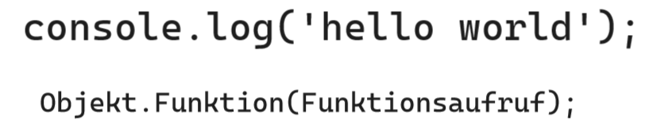
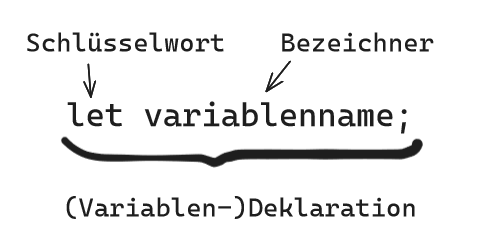

# Markdown zu JavaScript -> JS

## Allgemeines

- JS führt Browserseitig aus
- für Server braucht man node.js
- um zusätzliche Packages zu installieren auf node.js Server: npm (node package manager)
- React Famework für js mit größter Industrierelevanz
- Programmierrichtlinien: spezifische Regeln zur Schreibweise

- Skripte, die mit den Elementem der Website interagieren

## sinnvolle Links

- [nodejs.org](www.nodejs.org) Die offizielle Site zur Serverplattform Node.js. Ausführliche Dokumentation zum JS-Sprachkern und allen Node.js-spezifischen Erweiterungen.

- [caniuse.com](caniuse.com) Kann ich ein bestimmtes Feature benutzen? Diese Site kennt die Antwort. Ausführliche Übersichten zu neuen Features in HTML, CSS und JS mit Angaben zu den Browserversionen und Hinweisen zu Polyfills.


## Hilfreiche Shortcuts

- Konsole öffnen: cmd-alt-j (macOS); strl-shift-j (Windows/Linux)
- Run - den Code in der Konsole ausführen: Enter


## Semikolon!?

:exclamation: es gibt den semikolonlosen Stil und den Semikolon-Stil - mir wurde der Semikolon-Stil empfohlen (und die VSCode Erweiterung Prettier macht dies automatisch -> ASI Automatic Semicolon Inseration)


## Ausgabe in Konsole

`console.log('Hello World');`

`log` ist eine sogenannte Funktion. Ihre aufgabe ist es, in die Konsole (console) zu loggen, d.h. eine Ausgabe von Log-Meldungen einzutragen - wie in einem Logbuch.

- Im Log lässt sich die Ausgabe des Programmes Schritt für Schritt nachvollziehen. 
- Log nicht für Anwender bestimmt, sondern für Programmierer, um den Ablauf eines Programmes nachzuvollziehen


## alert

Die Funktion `alert` öffnet eine sogenannte Alert-Box im Browserfenster. Sie ist dafür gedacht, Anwendern wichtige Warnmeldungen anzuzeigen. Die Alert-Box ist ein modales Pop-up-Fenster, d. h. der Anwender muss sie wegklicken, um die Website weiter benutzen zu können. Aus Usability-Gründen ist von solchen modalen Pop-up-Fenstern abzuraten. <br />
Außerdem handelt es sich dabei um eine Funktion, die nur in Browserumgebungen zur Verfügung steht. Wenn du z. B. auf dem Server unter Node.js programmierst, kannst du sie nicht verwenden.

Sowohl `alert` als auch `log` sind Funktionen. Den Aufruf einer Funktion erkennst du an den runden Klammern (). Innerhalb der Klammern hinterlegst du ein Argument — wie hier 'Hello World'. Was mit dem Argument passiert, ist von der Funktion abhängig. Während alert einen Warnhinweis für den Anwender ausgibt, erzeugt `console.log` einen Logeintrag für uns Entwickler.

`alert` ist eine Funktion, die bereits im Browser implementiert ist. Der Browser bringt außerdem console mit, ein sogenanntes Objekt. Auf console steht dir dann wiederum die Funktion log zur Verfügung. Vorerst wirst du nur solche implementierten Funktionen verwenden. In Lektion 15 lernst du schließlich, deine eigenen Funktionen zu definieren.


## Funktionsaufruf Begriffe


- auf dem Objekt `console` steht wiederum die Funktion `log` zur Verfügung

- es gibt bereits im Browser implementierte Funktionen, man kann auch welche selbst definieren




## Syntax oder Semantik?

Syntax: Schreibfehler/Tippfehler/Aufbaufehler

Semantik: Bedeutung von Wörtern oder Sätzen


## Anweisungen

- man kann auch mehrere Anweisungen nacheinander loggen
- WICHTIG: jede Anweisung in eine eigene Zeile schreiben :exclamation:
- 


## strict mode

Man sollte `'use strict'` an den Anfang der JS-Datei schreiben, um sich selbst und dem Wartungsprogrammierer das Leben etwas einfacher zu machen.

Der "strict modus" bedeutet:

- :exclamation: Einige der neueren Sprachkonstrukte (z. B. let) lassen sich in den meisten Umgebungen überhaupt nur im strict mode verwenden.

- Einige Richtlinien, die der standard mode als reine Konvention betrachtet, führen im strict mode zu einer Fehlermeldung.

- Viele veraltete Sprachkonstrukte werden nicht mehr akzeptiert (z. B. die with-Anweisung)

- Fehlerhafter oder problematischer Code, den JS im standard mode ohne Murren akzeptiert, führt nun zu einer (meist) aussagekräftigen Fehlermeldung. Damit bemerkst du Probleme frühzeitig und sparst dir die oft aufwendige Fehlersuche.


## Kommentare

`//Einzeiliger Kommentar`

`/* hier kann ein mehrzeiliger Kommentar zwischen stehen */`


## Einbinden

Empfohlen ist im allgemeinen die JS Datei im `head` der HTML Datei einzubinden und das Attribut "defer" zu verwenden. (Es gibt natürlich auch Außnahmen etc.)

`<script src="JS-Datei.js" defer="defer"></script> `

- das `defer`-Attribut verzögert die Ausführung des Scripts, sodass sich das DOM erst komplett aufbauen kann.


## Notation

Um Ausgabewerte im Code darzustellen benutzt man den "fat arrow" `=>` (nicht zu verwechseln mit der fat arrow funktion)

```js
3 + 4 // => 7
console.log(3 + 4 * 2) // => 11
```


## Rechnen mit JS


- "3+7" ist ein Ausdruck
- Charakteristisch für Ausdrücke ist, dass sie einen Rückgabewert besitzen ( hier die Zahl 10)
- JS ersetzt den Ausdruck durch den (Rückgabe-)Wert
. einen Rückgabewert wiederum kann an verschiedensten Stellen des Codes eingesetzt werden (z.B. als Argument bei einem Funktionsaufruf)

### arithmetische Opertaoren

| Symbol | Operation       |
| ------ | --------------- |
| +      | Addition        |
| -      | Subtraktion     |
| *      | Multiplikation  |
| /      | Division        |
| %      | Modulo - Rest einer Division  |
| **     | Potenz (erst ab ECMAScript 2016)  |

### Math-Objekt

wird auch oft als utility object bezeichnet

Kleine Auswahl:

| Funktion o.<br>Konstante | Zweck         | Beispiel                   |
| ------------------------ | ------------- | -------------------------- |
| sqrt                     | Quadratwurzel | Math.sqrt(9) ergibt 3      |
| pow                      | Potenzieren   | Math.pow(2, 5) ergibt 32   |
| PI                       | &pi;          | Math.PI ergibt 3.141592    |
| cos                      | Kosinus       | Math.cos(Math.PI) ergibt 1 |
| random                   | Zufallszahl   | Math.random()liefert Zahlen zwischen 0 und 1 zurück, wobei die 1 nie erreicht wird |


- `Math.round(nummer)` -> rundet kaufmännisch (ab x.5 wird aufgerundet) 
- `Math.floor(nummer)` -> rundet immer ab (floor: Boden) 
- `Math.ceil(nummer)` -> rundet immer auf (ceil: Decke) 

Runden:
- `(nummer).toFixed(2)` -> Rundet die Nummer auf 2 Stellen hinter dem Komma
- ACHTUNG: Der Rückgabewert von `toFixed` ist immer `string`.


## Zeichenkette - String

Texte werden in Anführungszeichen geschrieben und bestehen eigentlich aus einer Aneinanderreihung bzw. Verkettung einzelner Zeichen. Deswegen lautet der Fachbegriff Zeichenkette (engl.: String)

JavaScript akzeptiert sowohl einfache als auch doppelte Anführungszeichen. Jedoch ist die konstante Verwendung von einfachen Anführungszeichen zur Konvention geworden.

- `"ein Text"` ist erlaubt aber schlecht
- `'ein Text'` ist erlaubt und bevorzugt
- `"ein Text'` ist falsch


### String-Eigenschaften

```js
'use strict'
console.log('Zeichenkette - auch Leerzeichen werden mitgezählt'.length) // => 49
```

### Verkettung von Strings

```js
console.log('string ' + 'string ' + 'string ') /* "eifnache" Verkettung von Strings */
console.log('string ' + variable + ' string ') /* "einfache" Verkettung von Strings und Variablen */
console.log(`string ${variable} string`) /* template string: so können Variablen innerhalb des Strings geschrieben werden 
                                        ACHTUNG: Hier sind Backticks notwendig! */
```
- mit `\n` kann man einen Zeilenumbruch in einem Template String einfügen

### Maskieren

Mit Hilfe des Backslash kann man Zeichen maskieren. Auch der Backslash selbst wird mit einem Backslash maskiert.
- mit `\"` kann man z.B. Anführungszeichen innerhalb eines Strings darstellen, ohne diesen ungewollt zu beenden

`"dies ist ein \"durchgängiger\" String"` // => dies ist ein "durchgängiger" String

## Literal

- wörtlich (engl.: literally)
- Literale haben immer einen festen Wert.

Beispiele: 
- 42 ist ein Literal
- 'Text' ist ein Literal
- 3+4 ist kein Literal, da nach Ausführen des Codes nicht 3+4 sonder 7 angezeigt wird


## Datentypen number & string

| Datentyp | Wertebereich / Bedeutung |
| -------- | ------------------------ |
| string   | Beliebige Texte          |
| number   | Beliebige positive und negative Zahlen  |

Mit dem Operator `typeof` kann man prüfen welchen Dstentyp ein Literal hat.

Der Rückgabewert von `typeof`ist ein String. 

```js
'use strict'
console.log(typeof 3764) // => number
console.log(typeof 'beautiful JS') // => string
console.log(typeof 27.31) // => number
```

### Implizite Typkonvertierung

- wenn ein oder beide Operanden ein String sind führt JS eine implizite Typkonvertierung durch (ACHTUNG: Außer beim Plus `+`!) 

Der Fachausdruck für implizite Typkonvertierung ist coercion.

### Explizite Typkonvertierung

Da das `+`-Zeichen auch ein Vekettungszeichen ist, funktioniert hiermit die implizite Typkonvertierung nicht. -> Der Interpreter kümmert sich nicht automatisch um die Typumwandlung. 

#### Funktion: Number()

Es gibt die Funktion `Number`, um einen String in Nummer umzuwandeln.

```js
'1' + '3' + '1' // => 131 (die Zahlen werden nur als String hintereinander geschrieben)

Number('1') + Number('3') + Number('1') // => 5 (die Zahlen/Strings werden in Nummern umgewandelt und "richtig" addiert)
```

- Number('25') ergibt 25 (Typ: number)
- Number('Hallo') ergibt NaN (Typ: number)

### NaN - Not a Number

Dieser Wert repräsentiert eine fehlgeschlagene numerische Operation. Das kann sowohl bei einer expliziten als auch bei einer impliziten Typkonvertierung passieren.

- `NaN` ein Wert vom Typ `number`

Das macht Sinn, denn: Überall dort, wo Werte vom Datentyp number zugelassen sind, ist auch NaN erlaubt. 

Damit kann auch im Fehlerfall ein Programm weiterhin lauffähig bleiben. Der Fehler wirkt sich im Ergebnis aus, das ist aber immer noch besser als ein vollständiger Programmabbruch. Ein NaN, das in einer numerischen Berechnung als Operand agiert, führt auch wieder zu einem Rückgabewert von NaN.

### isNaN

- Die Funktion isNaN stellt an das übergebene Argument die Frage, ob es sich nicht um eine Zahl handelt: »is Not a Number?«.
- Die Funktion gibt nur `true` oder `false` zurück.
- Die Funktion isNaN erwartet einen Wert vom Typ number. 


## Auswertungsreihenfolge von Operatoren

(auch Priorität oder Präzedenz)

| Priorität | Operator                                          |
| --------- | ------------------------------------------------- |
| 1         | Funktionsaufruf (z.B. `alert()`) <br> Klammern () |
| 2         |  ! <br> typeof                                    |
| 3         |  * <br> / <br> %                                  |
| 4         | + <br> -                                          |
| 5         |  < <br> > <br> <= <br> >=                         |
| 6         |  === <br> !==                                     |
| 7         |  &&                                               |
| 8         |  \|\|                                             |
| 9         |  = <br> += <br> -= <br> *=  <br> /= <br> %=       |


Operatoren, die den gleichen Rang haben, werden meist von links nach rechts ausgewertet. Meist heißt, dass es einige Ausnahmen gibt. Ein Beispiel ist der Zuweisungsoperator =, den JS von rechts nach links auswertet.

Zusammengesetzte Zuweisungsoperatoren (z.B. `+=`) speichern einen Wert zurück und funktionieren deswegen nur mit Variablen.

### Empfohlene Programmierrichtlinie:

- Verwende Klammern, um Zweifel über die Auswertungsreihenfolge von Ausdrücken auszuräumen oder wenn du der Meinung bist, dass der Code dadurch lesbarer sein könnte.

- Vor und nach einem Operator mit zwei Operanden (z. B. Additions- oder Zuweisungsoperator) steht ein Leerzeichen.


## Logische Operatoren

### Oder-Operator `||`

Das Ergebnis einer Oder-Verknüpfung ist dann wahr, wenn entweder der eine oder der andere Wert true ist.

### Und-Operator `&&`

Das Ergebnis einer Und-Verknüpfung ist dann true, wenn beide Variablen den Wert true enthalten.

### Nicht-Operator `!`

Er wird in JavaScript als Ausrufezeichen `!` notiert. Man stellt ihn einfach vor einen Rückgabewert. Er wandelt ein `true` in ein `false` um — und umgekehrt.


## Variablen

Variablen: Bezeichner (engl.: identifier)

Um JS zu signalisieren, dass es sich um eine Variable handelt benutzt man das Schlüsselwort (engl.: keyword) `let` oder `const`. Das Gleicheitszeichen `=` nennt sich hier: Zuweisungspoerator.<br>

`let variablenname = 'Wert';`

:exclamation: Schlüsselwörter sind ein fester Bestandteil der Programmiersprache. Sie haben eine fest definierte Bedeutung und können nicht für andere Zwecke eingesetzt werden. Schlüsselwörter werden in JS immer komplett klein geschrieben.



Wichtig ist, dass auf der linken Seite der Zuweisung der Variablenbezeichner steht und auf der rechten Seite der Wert. Ebenfalls essenziell sind die Anführungszeichen. Daran erkennt JS, dass es sich um den Wert handelt und nicht etwa um eine Variable.


### Konstanten

Damit dienen diese Konstanten gewissermaßen der Konfiguration deines Programms. Wenn du das konsequent umsetzt, findest du am Anfang deines Programms eine Ansammlung dieser Konstanten und siehst somit auf einen Blick alle relevanten »Stellschrauben«.

#### Programmierrichtlinien zu Konstanten

- Schreibe Konstanten, die der Konfiguration dienen, komplett in Großbuchstaben und verwende den Underscore _ zur Worttrennung. `const TAX_RATE = 1.19`

- Deklariere Konstanten, die der Konfiguration dienen, am Anfang deines Codes.

- Vermeide "Magic Numbers" -> Nummern, die "aus dem nichts" im Code verwendet werden.


## Bezeichner

- verwende aussagekräftige Bezeichner
- keine Sonderzeichen
- Abkürzungen am besten nur aus den Abkürzungs- und Akronymwörterbüchern
- Variablen: in camelCase `let diesIstEineVariable`
- Konstanten: in SCREAMING_SNAKE_CASE `const DIES_IST_EINE_KONSTANTE`
- JS-Bezeichner sind case-sensitive: Unterscheidet zwischen Groß- und Kleinschreibung
- Nomen für Variablenbezeichner: z.B. `farbe` statt `färben`
- Variablenbezeichner im Singular


## PROMPT

`let variablenname=prompt("Ausgabe im Popup", "placeholder vor Eingabe")`

HINWEIS: Die `prompt`-Funktion pausiert das Programm. -> JS läuft nur bis zum Programm und wartet dann auf die Eingabe.


## Ausdruck - Definition

Ein Ausdruck ist
- ein Literal
- eine Variable/Konstante
- eine beliebige syntaktisch-korrekte Kombination aus Literalen, Variablen, Operatoren und Funktionsaufrufen.


## Datentyp: Boolean

- Dieser ist immer true oder false.
- Ein Ausdruck, der einen solchen booleschen Rückgabewert hat (ein boolescher Ausdruck), heißt auch Bedingung.


## Vergleichsoperatoren (auch relationale Operatoren)

| Symbol | Operation           |
| ------ | ------------------- |
| <      | kleiner             |
| >      | größer              |
| <=     | kleiner oder gleich |
| >=     | größer oder gleich  |
| ===    | identisch           |
| !==    | nicht identisch     |

`===` und `!==` berücksichtigen auch die Datentypen, d.h. `'42' !== 42` (da string !== number). -> Das === ist recht einfach zu verstehen: Unterschiedliche Datentypen bedeuten, dass die Werte nicht gleich sind!

### Strings miteinander vergleichen

- bei Strings fürt JS ein lexikographischen Vergleich durch
    - d.h. die Wörter werden zunächst aufgrund ihrer Anfangsbuchstaben geordnet, dann nach dem zweiten Buchstaben usw. 
    - auch die Ziffern werden bei Strings nacheinander lexikographisch verglichen
- sortiert wird nach dem ASCII Code [Link zur Tabelle](https://www.ascii-code.com/de)
    - Großbuchstaben vor Kleinbuchstaben


Beispiele:
- 'a' > 'A' ergibt true
- '23' < 37 ergibt true
- '300' < 4 ergibt false
- '4' < 300 ergibt true
- 300 < 4 ergibt false
- '300' < '4' ergibt true
- 'Ladislaus' > 'Oswine' ergibt false
- 'Anton' > 'Alan' ergibt true


## if und else Anweisungen

### If-Anweisung

 Wenn (if) eine bestimmte Bedingung wahr (true) ist, dann führe eine oder mehrere Anweisungen aus.

Die if-Anweisung besteht aus:
 - Schlüsselwort if
 - einer Bedingung (boolescher Ausdruck) in runden Klammern
 - einem Rumpf in geschweiften Klammern, der die Anweisungen enthält

```js
if (Bedingung) {
    Anweisung1
    Anweisung2
    // ...
}
```

### Else-Anweisung

Die else-Anweisung besteht aus:

- dem Schlüsselwort else und
- einem Rumpf mit Anweisungen.

```js
if (Bedingung) {
    Anweisung1a
    Anweisung2a
    // ...
} else {
    Anweisung1b
    Anweisung2b
    // ...
}
```

### Programmierrichtlinien

- Nach dem Schlüsselwort `if` oder `else` folgt genau ein Leerzeichen.
- Die öffnende geschweifte Klammer `{` des Rumpfes befindet sich in der gleichen Zeile wie das Schlüsselwort.
- Nach der öffnenden Klammer des Rumpfes folgt ein Zeilenumbruch.
Die Anweisungen innerhalb des Rumpfes werden per Tab (jeweils um 4 Leerzeichen) eingerückt.
- Die schließende geschweifte Klammer `}` des Rumpfes befindet sich auf einer eigenen Zeile und ist linksbündig zum ersten Schlüsselwort.

Ausnahme:

- Enthält der Rumpf nur eine einzige Anweisung, so dürfen die Zeilenumbrüche und die geschweiften Klammern entfallen.


## Der ternäre Operator

Der ternäre Operator hat drei Operanden (deswegen ternär) und trennt diese mit den Zeichen `?` und `:`.

"normale" if-else-Anweisung:
```js
'use strict'
let productCategory = 'books'
let netPrice = 10
let taxRate

if (productCategory === 'books') {
    taxRate = 1.07
} else {
    taxRate = 1.19
}

let totalPrice = netPrice * taxRate // => 10.70
```

ternäre Operator:
```js
'use strict'
let productCategory = 'books'
let netPrice = 10
let taxRate

taxRate = productCategory === 'books' ? 1.07 : 1.19

let totalPrice = netPrice * taxRate // => 10.70
```
Der ternäre Operator verhält sich dabei ähnlich wie ein if-else.

Ist das Ergebnis true, gibt der Gesamtausdruck den ersten Wert, d. h. den Wert zwischen `?` und `:` zurück: -> `1.07`. Im anderen Fall erhältst du den Wert nach dem `:` -> `1.19` .


## Funktionen um Strings zu manipulieren

### indexOf & lastIndexOf

Mithilfe von `indexOf` kannst du die Position eines bestimmten Strings innerhalb eines größeren Strings herausfinden.

`indexOf` erwartet den zu suchenden String als Argument und gibt dir die Position zurück. 

```js
'use strict'
let name = 'Julia Bellmann';
console.log(name.indexOf('a')) // => 4 (da von 0 zählend: 0:J, 1:u, 2:l; 3:i; 4:a)
console.log(name.indexOf(' ')) // => 5 (die Position von Leerzeichen können auch angegeben werden)
console.log(name.lastIndexOf('a')) // => 11 (das letzte a ist auf Position 11)
```

- Die Zählung der Position beginnt bei 0
- Wenn die Funktion `indexOf` den gewünschten String nicht findet, gibt sie -1 zurück.
- `indexOf` gibt die Position des ersten Fundes aus.
- `indexOf` beginnt am Anfang des Strings mit der Suche. Falls du die Suche aber lieber von hinten beginnen möchtest: Die Funktion `lastIndexOf` findet das letzte Vorkommen des gesuchten Strings.

### substr & substring

Die Funktion `substr` (von substring, dt.: Teilzeichenkette) extrahiert einen Teilstring aus einem größeren String.


Es gibt neben der gerade vorgestellten Funktion substr noch die Funktion `substring`. Diese funktioniert weitestgehend gleich, hat jedoch einen gravierenden Unterschied. Beide extrahieren jeweils einen Teil einer Zeichenkette. Der Hauptunterschied besteht in der Art und Weise, wie sie Anfangs- und Endpunkte für den zu extrahierenden Teilstring angeben.

Die Funktion `substr` erhält optional als zweiten Parameter die length also die Anzahl an Zeichen, die der Teilstring enthalten soll. `substring` hingegen erhält als zweiten optionalen Parameter den Index, an dem der Teilstring enden soll. Das Zeichen, das an diesem “Endindex“ ist, wird jedoch nicht mit extrahiert.

Der Hauptunterschied liegt also in der Art und Weise, wie die Funktionen ihre zweiten Parameter (length und end) behandeln.

```js
'use strict';
let text = 'Hello World';

// Beispiel für substr

let substrResult = text.substr(1, 3);

console.log('substr:', substrResult); // Ausgabe: "ell"

// Erklärung: Extrahiere 3 Zeichen ab Index 1 (0-basiert)

// Beispiel für substring

let substringResult = text.substring(1, 3);

console.log('substring:', substringResult); // Ausgabe: "el"

// Erklärung: Extrahiere den Teilstring von Index 1 (einschließlich) bis Index 3 (ausschließlich)

// für das gleiche Resultat wie bei substr muss der End Index um eins erhöht werden

substringResult = text.substring(1, 4);

console.log('substring:', substringResult); // Ausgabe: "ell"

```

### trim

`trim` entfernt Leerzeichen am Anfang und am Ende eines Strings, nicht jedoch in der Mitte. 

```js
'use strict';
let name = '   Julia Bellmann     '; // viele Leerzeichen vor und nach dem Namen

console.log(name.trim()); // => "Julia Bellmann" (ohne die Leerzeichen vor und nach dem Namen)
```

### charAt

`charAt` erwartet als Parameter die Position des zu extrahierenden Zeichens

```js

'use strict'
let firstName = 'Julia'
let lastName = 'Bellmann'

console.log(`${lastName}, ${firstName.charAt(0)}.`) // => "Bellmann, J."

```

### toLowerCase & toUpperCase

Wandeln den String entweder komplett in Kleinbuchstaben oder Großbuchstaben

### replace

`replace` ermöglicht es innerhalb eines Strings Ersetzungen vorzunehmen.


```js

'use strict';
let oldStringName = 'alter Text';
let newStringName = 'neuer Text';

let text = `lorem ipsum alter Text bla bla alter Text`; 

console.log(text.replace(oldStringName, newStringName)); // ersetzt jedoch nur das erste Vorkommen der ersten Variable.

```

Um alle zu ersetzenden Variablen zu erreichen schreibt man für den zu ersetzenden Text den Parameter folgendermaßen:
`/Suchbegriff/g`

Der Buchstabe `g` steht für *global* und sorgt dafür, dass die Funktion die Ersetzungen im ganzen Text durchführt, statt nur an der ersten Stelle. 

:exclamation: Beachte, dass der reguläre Ausdruck in Slashes steht und nicht in Anführungszeichen!

Die Schrägstriche (Slashes) kennzeichnen eine sogenannte *Regular Expression* (dt.: regulärer Ausdruck). Regular Expressions sind hilfreich bei der Texterkennung und bieten eine Vielzahl an Möglichkeiten. Dazu in einem späteren Kapitel mehr.

```js

'use strict';
let oldStringName = /alter Text/g;
let newStringName = 'neuer Text';

let text = `lorem ipsum alter Text bla bla alter Text`; 

console.log(text.replace(oldStringName, newStringName)); // ersetzt jedoch nur das erste Vorkommen der ersten Variable.

```
### includes


________


später verarbeiten:


